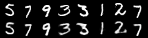
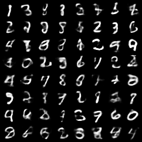

# Basic VAE Example

This is an improved implementation of the paper [Auto-Encoding Variational Bayes](http://arxiv.org/abs/1312.6114) by Kingma and Welling. It uses ReLUs and the adam optimizer, instead of sigmoids and adagrad. These changes make the network converge much faster.

**Results:**

<div align='center'>
  
  
</div>

**Train:**
  
```
pip install -r requirements.txt
python main.py
```
The `main.py` script accepts the following arguments:

```
optional arguments:
  --batch-size		input batch size for training (default: 128)
  --epochs		number of epochs to train (default: 10)
  --no-cuda		enables CUDA training
  --seed		random seed (default: 1)
  --log-interval	how many batches to wait before logging training status
```
**Reference:**
1.  All credits to https://github.com/pytorch/examples
